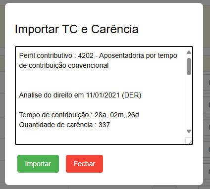
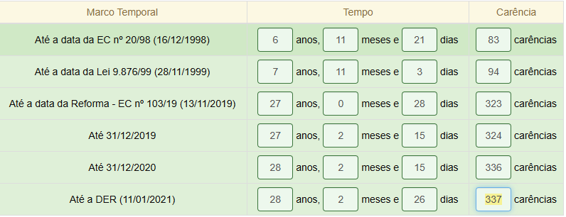

# PTI TC e Carência

## O que é?

Em poucas palavras: uma extensão de navegador que funciona no site [Tramitação Inteligente](https://planilha.tramitacaointeligente.com.br/), adicionando a possibilidade de importar, automaticamente de uma só vez, o Tempo de Contribuição e Carências já reconhecidas pelo INSS na Análise de Direito.

A importação se dá colando o resultado fornecido pelo programa [Extrator de TC e Carência](https://github.com/joaotextor/extrator-tc-carencia).

## Funciona em quais navegadores?

A extensão funciona no Mozilla Firefox e em qualquer outro navegador baseado no Chromium (Goolge Chrome, Microsoft Edge, Opera, Opera GX, etc).

## Passo a passo

### Instalação

Firefox: [PTI TC e Carência – Instale esta extensão para o 🦊 Firefox (pt-BR)](https://addons.mozilla.org/pt-BR/firefox/addon/pti-tc-e-car%C3%AAncia/)

Chrome/Edge/Opera: [PTI TC Carencia - Chrome Web Store](https://chromewebstore.google.com/detail/pti-tc-carencia/bfkfplicpbcabmocloclajcinmkgjfhp)

### Uso

1. Clique no botão "Importar TC e Carência", em uma planilha nova ou existente:

2. Cole o texto formatado obtido com o Extrator e clique em Importar:

3. Aguarde o rápido preenchimento das informações:

